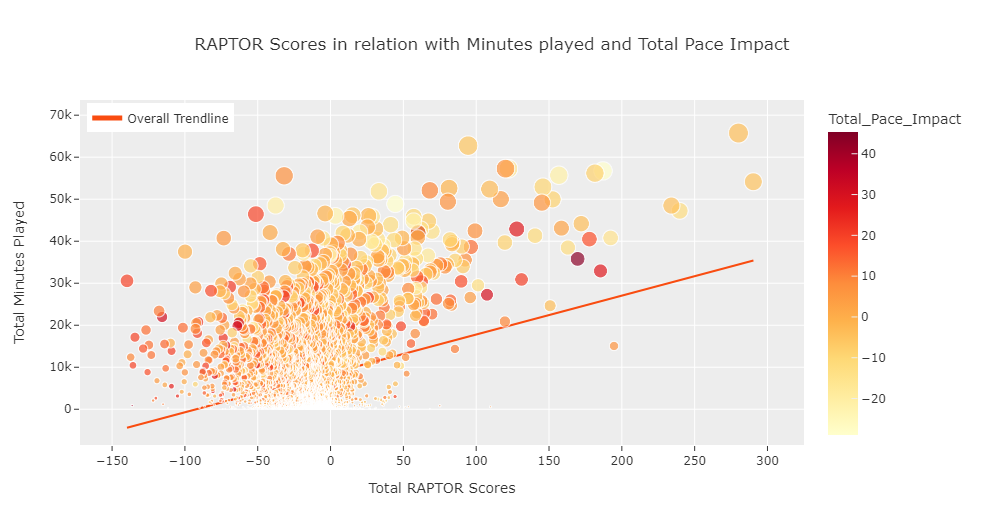

# Exploratory Analysis of RAPTOR Metrics in the Modern NBA

## Project Overview
RAPTOR (Robust Algorithm (using) Player Tracking (and) On/Off Ratings) is a modern-day plus-minus statistical analysis developed by FiveThirtyEight. This system measures the number of points a player contributes to his team’s offense/defense per 100 possessions, relative to a league-average player. Our team will be analyzing the `latest_RAPTOR_by_team.csv` (play-by-play metrics from the 2022-2023 NBA season) and the approximate `historical_RAPTOR_by_team.csv` charts (predictive analyses dating from 1977-2022) to analyze comparisons between both sets of data across a variety of criteria. 

## Installation and Usage Instructions of Libraries/Tools
We are utilizing two datasets within FiveThirtyEight's RAPTOR database:

- [Latest RAPTOR Analytics by Team](https://projects.fivethirtyeight.com/nba-model/2023/latest_RAPTOR_by_team.csv) 
- [Historical RAPTOR Analytics by Team](https://github.com/fivethirtyeight/data/blob/master/nba-raptor/historical_RAPTOR_by_team.csv) 

### Required Libraries:
- Pandas
- Numpy
- Matplotlin
- Scipy, stats module.
- Seaborn
- Plotly.graph_objects
- Plotly.express.
### Tool(s) required:
- Jupyter notebook,pyviz environment.
## Intro
RAPTOR (Robust Algorithm (using) Player Tracking (and) On/Off Ratings) is a modern-day plus-minus statistical analysis developed by FiveThirtyEight. This system measures the number of points a player contributes to his team’s offense/defense per 100 possessions, relative to a league-average player. 
_Why RAPTOR?_ 
RAPTOR fulfills two long-standing goals:
- First, to create a publicly available statistic that takes advantage of modern NBA data, specifically player tracking and play-by-play data that isn’t available in traditional box scores.
- Second, and relatedly,  a statistic that better reflects how modern NBA teams actually evaluate players.

## Project Goals
- Does the amount of possessions per player greatly impact that player’s overall RAPTOR ratings? Why or why not?
- Which team displayed the highest/lowest RAPTOR ratings across the 2022-23 season across all players? How does this data compare to their predictive PREDATOR model?
- How accurate are the overall results of predictive-RAPTOR, which was used for the historical data charts (1977-2013), compared to those of modern - RAPTOR’s integration (2013-Present)? 
- Is there a relationship between most minutes played and the greatest pace impact on the team compared to RAPTOR scores?
- How do these statistics line up by player in relation to the top players/teams (MVPs) of the 2022-2023 season?
- Find out relationship between different features.

## Data Cleaning
There are two separate datasets for this challenge, the historical dataset which includes data from 1977-20xx and the latest dataset which is for 2023 
The first step was to import the datasets and then merge them 
Then the datasets were checked for null values, there were some null values under historical data which was then filled and checked for duplicates, finally giving us our clean dataset to work with.
## Analysis
- If we were to find a relationship between the total minutes played by a player and the pace impact for their team in reference to their RAPTOR scores, we can see that there is a weak but a positive correlation between the total minutes played and RAPTOR scores. When we look at the total pace impact for their teams, there isn’t any strong indication that the amount of time they played overall impacts the pace.
## Visuals

## Additional Explanations

## Major Findings

## Limitations

## Conclusions

## References 
For dataset : [FiveThirtyEight](https://fivethirtyeight.com/features/how-our-raptor-metric-works/)
## Team Members
- Christopher
- Jack
- Jonathan
- Uzma
- Wipawadee